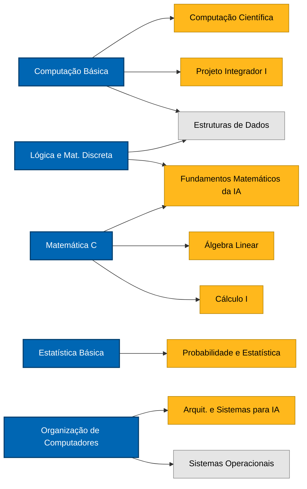

<div align="center">

# 🎓 UFFS — Ciência da Computação

**Diário de bordo da minha graduação em Ciência da Computação na Universidade Federal da Fronteira Sul**

[](https://www.uffs.edu.br/)
[](https://www.uffs.edu.br/)
[]()


</div>

---

## 📌 Sumário

- [Sobre o Repositório](#-sobre-o-repositório)
- [Estrutura](#-estrutura)
- [Convenções](#-convenções)
- [Progresso por Semestre](#-progresso-por-semestre)
- [1º Semestre em Curso](#-1º-semestre-em-curso)
- [Grade Curricular](#-grade-curricular)
- [Mapa de Disciplinas](#-mapa-de-disciplinas)
- [Tecnologias](#️-tecnologias)
- [Como Executar](#️-como-executar)
- [Contato](#-contato)
- [Licença](#-licença)

---

## 📖 Sobre o Repositório

Este repositório reúne **exercícios, trabalhos, projetos integradores e anotações** produzidos ao longo do meu **Bacharelado em Ciência da Computação** na [Universidade Federal da Fronteira Sul (UFFS)](https://www.uffs.edu.br/) — Campus Erechim.

A proposta é simples: **documentar a jornada**, manter uma referência pessoal organizada por semestre e disciplina, e compartilhar o que aprendi com quem estiver começando o mesmo caminho.

- 🏫 **Instituição:** UFFS — Campus Erechim
- 🎯 **Curso:** Bacharelado em Ciência da Computação
- 📅 **Início:** 2026/1
- ⏳ **Duração:** 4 anos · 8 semestres
- 📍 **Status atual:** cursando o **1º semestre**

---

## 📁 Estrutura

O repositório é organizado por **semestre** e, dentro de cada um, por **disciplina**:

```
uffs-cc/
├── 1-semestre/
│   └── <disciplina>/
│       └── <exercícios, projetos, anotações>
├── 2-semestre/
├── ...
└── 8-semestre/
```

Cada pasta de disciplina contém o material específico daquela cadeira (códigos, relatórios, exercícios resolvidos, apresentações, etc.).

---

## 📐 Convenções

Para manter o repositório fácil de navegar, sigo um padrão simples de nomenclatura de arquivos dentro de cada disciplina:

| Tipo de arquivo | Padrão | Pasta sugerida |
|---|---|---|
| Avaliação somativa (prova) | `prova_N1.<ext>`, `prova_N2.<ext>` | `provas/` |
| Trabalho avaliado | `trabalho_<tema>.<ext>` | `trabalhos/` |
| Lista de exercícios | `lista01_<tema>.<ext>` | `exercicios/` |
| Resumo pessoal | `resumo_<tema>.<ext>` | `resumos/` |
| Material de referência | `ref_<topico>.<ext>` | `resumos/` ou `assets/` |
| Código auxiliar | `<descricao>.<ext>` | `codigo/` |

**Outras convenções:**

- Idioma padrão: **português (pt-BR)**.
- Nomes de pastas e arquivos em **minúsculas**, com hífen ou underscore — sem espaços ou acentos.
- Arquivos `.gitkeep` existem apenas para preservar pastas vazias e devem ser removidos quando a pasta tiver conteúdo real.
- Arquivos sensíveis (chaves, `.env`, dados pessoais) ficam fora do repositório — ver `.gitignore`.

---

## 📊 Progresso por Semestre

<div align="center">


-0066B3?style=for-the-badge)


</div>

<br>

| # | Período | Tema | Status |
|:---:|:---:|:---|:---|
| [**1º**](./1-semestre) | `2026/1` | Fundamentos de computação e matemática | 🔵 **Em andamento** |
| [**2º**](./2-semestre) | `2026/2` | Base matemática e Projeto Integrador I | ⚪ Planejado |
| [**3º**](./3-semestre) | `2027/1` | Estruturas, bancos de dados e ML | ⚪ Planejado |
| [**4º**](./4-semestre) | `2027/2` | Sistemas, redes e web | ⚪ Planejado |
| [**5º**](./5-semestre) | `2028/1` | Computação gráfica, mobile e empreendedorismo | ⚪ Planejado |
| [**6º**](./6-semestre) | `2028/2` | Engenharia de software e TCC I | ⚪ Planejado |
| [**7º**](./7-semestre) | `2029/1` | Computação em nuvem, MLOps e TCC II | ⚪ Planejado |
| [**8º**](./8-semestre) | `2029/2` | Estágio curricular e disciplinas finais | ⚪ Planejado |

<sub>🟢 Concluído &nbsp;·&nbsp; 🔵 Em andamento &nbsp;·&nbsp; ⚪ Planejado</sub>

---

## 🎯 1º Semestre em Curso

Acesso direto às disciplinas que estou cursando agora:

| Disciplina | Código | Dia | Status | Pasta |
|---|---|:---:|:---:|:---:|
| Computação Básica | `GEX1058` | Seg | 🔵 Em andamento | [📁](./1-semestre/computacao-basica) |
| Organização de Computadores | `GEX1419` | Ter | 🔵 Em andamento | [📁](./1-semestre/organizacao-de-computadores) |
| Estatística Básica | `GEX1059` | Qua | 🔵 Em andamento | [📁](./1-semestre/estatistica-basica) |
| Lógica e Matemática Discreta | `GEX1418` | Qui | 🔵 Em andamento | [📁](./1-semestre/logica-e-matematica-discreta) |
| Matemática C | `GEX1062` | Sex | 🔵 Em andamento | [📁](./1-semestre/matematica-c) |

---

## 📚 Grade Curricular

<details>
<summary><strong>1º Semestre</strong> — fundamentos</summary>

- Computação Básica
- Estatística Básica
- Lógica e Matemática Discreta
- Matemática C
- Organização de Computadores

</details>

<details>
<summary><strong>2º Semestre</strong> — base matemática e primeiro projeto integrador</summary>

- Álgebra Linear
- Cálculo I
- Computação Científica
- Fundamentos Matemáticos da IA
- Probabilidade e Estatística
- Projeto Integrador I

</details>

<details>
<summary><strong>3º Semestre</strong> — estruturas, bancos de dados e ML</summary>

- Aprendizagem de Máquina I
- Banco de Dados I
- Cálculo II
- Estruturas de Dados
- Linguagens de Programação
- Projeto Integrador II

</details>

<details>
<summary><strong>4º Semestre</strong> — sistemas, redes e web</summary>

- Arquiteturas e Sistemas de Computação para IA
- Banco de Dados II
- Desenvolvimento de Sistemas Web
- Redes de Computadores
- Sistemas Operacionais
- Projeto Integrador III

</details>

<details>
<summary><strong>5º Semestre</strong> — gráfica, mobile e empreendedorismo</summary>

- Computação Gráfica
- Desenvolvimento para Dispositivos Móveis
- Empreendedorismo
- Iniciação à Prática Científica
- Inovação Tecnológica
- Optativa I
- Projeto Integrador IV

</details>

<details>
<summary><strong>6º Semestre</strong> — engenharia e TCC I</summary>

- Desenvolvimento Técnico e Científico
- Engenharia de Software
- Optativa II
- Planejamento e Gestão de Projetos
- Robótica e Sistemas Autônomos
- TCC I

</details>

<details>
<summary><strong>7º Semestre</strong> — nuvem, MLOps e TCC II</summary>

- Computação em Nuvem e Sistemas Distribuídos
- Direitos e Cidadania
- Engenharia de Sistemas de IA e MLOps
- História da Fronteira Sul
- Licenciamento Ambiental
- Optativa III
- TCC II

</details>

<details>
<summary><strong>8º Semestre</strong> — estágio e finalização</summary>

- Economia da Inovação e Startups
- Estágio Curricular
- Liderança Técnica e Gestão de Produto
- Meio Ambiente, Economia e Sociedade
- Optativa IV
- Optativa V

</details>

---

## 🗺️ Mapa de Disciplinas

Visão simplificada das principais cadeias de pré-requisitos a partir do 1º semestre — ajuda a entender o porquê de cada disciplina inicial.



<sub>🔵 1º semestre &nbsp;·&nbsp; 🟡 2º semestre &nbsp;·&nbsp; ⚪ semestres seguintes</sub>

---

## 🛠️ Tecnologias

**Usadas até agora:**


**Previstas ao longo da grade:**


---

## ▶️ Como Executar

Clone o repositório e entre na pasta da disciplina desejada:

```bash
git clone https://github.com/carloshjes/uffs-cc.git
cd uffs-cc/1-semestre/computacao-basica
```

Para rodar um script Python:

```bash
python nome_do_arquivo.py
```

> 💡 A maioria dos exercícios é autocontida e não exige dependências externas. Quando necessário, cada pasta terá seu próprio `README.md` ou `requirements.txt`.

---

## 📬 Contato

- **GitHub:** [@carloshjes](https://github.com/carloshjes)
- **LinkedIn:** [Carlos Henrique](https://www.linkedin.com/in/carlos-henrique-aa53523b9/)
- **E-mail (Gmail):** c.henriquejesus2000@gmail.com
- **E-mail (Outlook):** c.henriquejesus@outlook.com

Sugestões, correções ou dúvidas são muito bem-vindas — fique à vontade para abrir uma [issue](https://github.com/carloshjes/uffs-cc/issues) ou deixar uma ⭐ se o repositório te ajudou de alguma forma.

---

## 📄 Licença

Repositório de uso **educacional**, licenciado sob [Creative Commons Attribution 4.0 International (CC BY 4.0)](./LICENSE).

O conteúdo autoral pode ser livremente utilizado como referência para estudos, desde que a fonte seja citada. Materiais de aula, enunciados de exercícios e recursos de terceiros pertencem aos seus respectivos autores e à UFFS.

---

<div align="center">

*"O conhecimento se constrói um commit de cada vez."*

</div>
